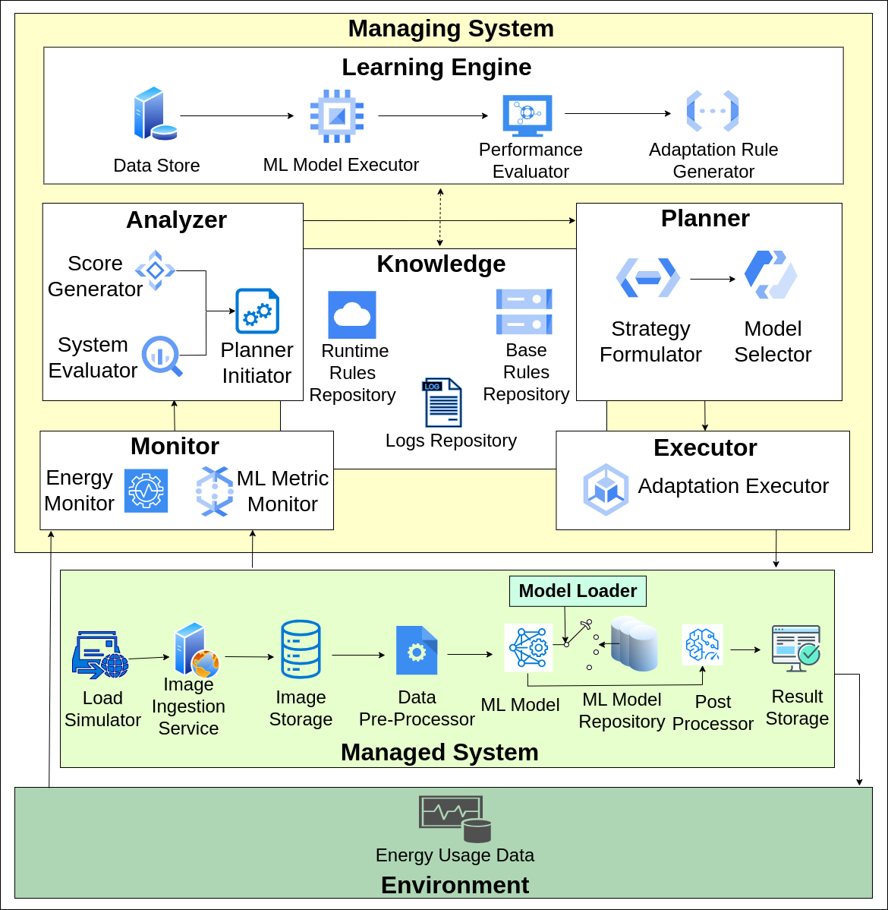
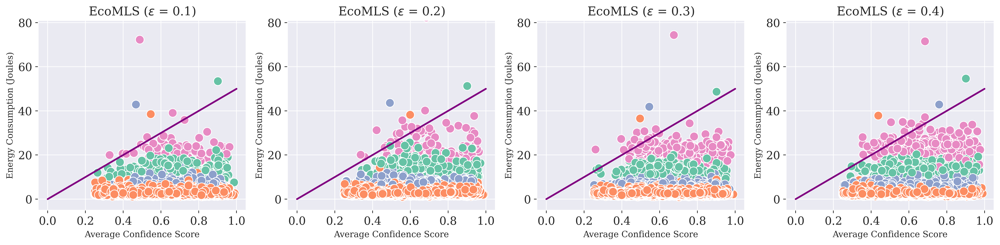
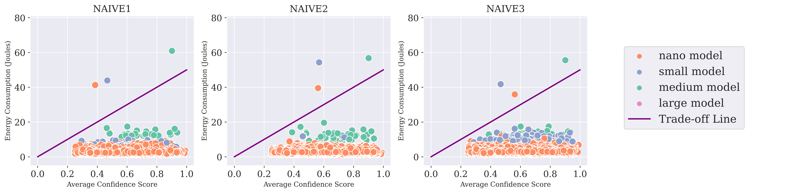
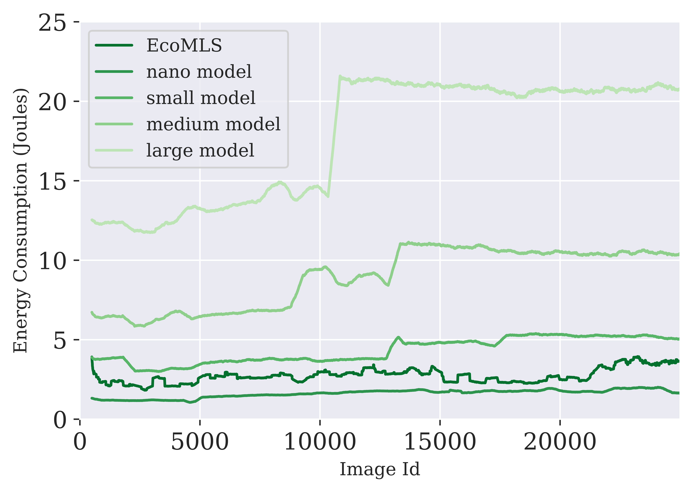

# EcoMLS:  Self-Adaptation Approach for Architecting Green ML-Enabled Systems

### Meghana Tedla, Shubham Kulkarni, Karthik Vaidhyanathan
---

This repository contains the implementation of an object detection exemplar developed for our submission to Greens Workshop, co-located with ICSA24.

We introduce EcoMLS approach, which leverages the Machine Learning Model Balancer concept to enhance the sustainability of Machine Learning-Enabled System (MLS) through runtime ML model switching. By adapting to monitored runtime conditions, EcoMLS optimally balances energy consumption with model confidence, demonstrating a significant advancement towards sustainable, energy-efficient machine learning solutions. 

Our EcoMLS approach is demonstrated through the utilization of the [SWITCH](https://github.com/sa4s-serc/switch) exemplar's managed system and environment manager, an object detection web service.

This service employs a streamlined architecture for efficient image processing, including:

1. **Image Ingestion Service**: Handles asynchronous requests to emulate real-world scenarios.
2. **Image Store**: Acts as a dynamic FIFO queue for incoming image data.
3. **Data Preprocessor**: Prepares images for detection processing.
4. **Model Loader**: Dynamically selects machine learning models based on the chosen approach.
5. **Model Repository**: Stores a variety of preloaded models for quick deployment.
6. **ML Model**: Executes detection processing at the core.
Post Processor: Refines detection results.
Result Storage: Temporarily retains processed data before final transfer.

**Architecture of EcoMLS:**
<div align="center">
    
</div>


### Approaches Tested
1. **NAIVE1**: Used a fixed knowledge for model switching.
2. **NAIVE2**: Updating knowledge based on monitored average confidence.
3. **NAIVE3**: Updating knowledge based on monitored average confidence and energy metrics.
4. **EcoMLS**: Building on NAIVE3 with $\epsilon$-greedy algorithm to employ explorartion and exploitation.


## Installation and  Set-up:
### Prerequisites:
- Python 3.8 or later
- [locust](https://locust.io/): for load testing
- [fastapi](https://fastapi.tiangolo.com/): for building API services
- [uvicorn](https://www.uvicorn.org/): for running ASGI applications
- [pyRAPL](https://pyrapl.readthedocs.io/en/latest/): for measuring energy consumption of the CPU

To get started with `EcoMLS`, follow these steps:
1. Clone the repository using the following command:
```bash
git clone <repository-url>
```
2. Upgrade the ultralytics package by running:
```bash
pip install --upgrade ultralytics
``` 
See the [YOLOv5 Repo](https://github.com/ultralytics/yolov5) for more details.

3. Install [pyRAPL](https://pyrapl.readthedocs.io/en/latest/) for energy monitoring:
```bash
pip install pyRAPL
```

> [!WARNING]  
> pyRAPL, used for monitoring CPU consumption is only available on Intel CPUs from the Sandy Bridge generation (2nd gen) onwards.

```bash
sudo chmod -R a+r /sys/class/powercap/intel-rapl
```

4. Create a folder named `IMAGES` in the `EcoMLS` directory and move all the test image files into it.

5. In the `EcoMLS` directory, create an empty folder named `images`. This folder will be used to store image data present in the queue.


## File Structure:
- `EcoMLS`: 
    - The main directory housing the EcoMLS system.
- `NAIVE1`: 
    - Contains `Analyzer.py` and `Planner.py`, implementing the NAIVE1 approach.
- `NAIVE2`: 
    - Contains `Analyzer.py` and `Planner.py`, implementing the NAIVE2 approach.
- `NAIVE3`: 
    - Contains `Analyzer.py` and `Planner.py`, implementing the NAIVE3 approach.
- `Learning_Engine`: 
    - Utilizes the [COCO Test dataset 2017](https://arxiv.org/abs/1405.0312)  for individual testing of all YOLOv5 models to derive detection results.
    - `Performance_Evaluator.ipynb`: This file generates the performance matrix, crucial for synthesizing the foundational adaptation rules for the EcoMLS approach.
- `Results`:
    - Stores log files and energy metrics of the MAPE-K loop for various approaches, organized in subdirectories named by respective approaches.
- `results.ipynb`:
    - Final result plots are presented here.

## Running EcoMLS - An Object Detection Prototype

>[!Note]
> 1. Before starting the prototype, ensure to empty the images folder.
> 2. Upon running the prototype, `log.csv` and `MAPEK_energy.csv` files will be generated or overwritten in the EcoMLS directory if they already exist.
> 3. To run `NAIVE1`, `NAIVE2`, and `NAIVE2`, replace `Analyzer.py` and `Planner.py` files in the `EcoMLS` directory with the files present in the `NAIVE1`, `NAIVE2`, and `NAIVE3` directories, respectively.

### API Set-up
To facilitate user interaction and provide a seamless experience, an API has been initiated.

To run a single state-of-the-art YOLOv5 model, NAIVE approach, or EcoMLS approach:

From the EcoMLS directory, execute the following command:
```bash
python3 App.py
```

### Sending requests to the API
To simulate a FIFA98 scenario with up to 28 parallel requests per second and a total of 25,000 requests, images from the `IMAGES` folder will be sent at a rate that adheres to the resampled scaled inter-arrivals specified in the `resampled_scaled_inter_arrivals.csv` file.

To run a single state-of-the-art YOLOv5 model, NAIVE approach, or EcoMLS approach:

From the EcoMLS directory, execute the following command:
```bash
locust -f Request_send.py --host=http://localhost:5000/v1
```

After executing the command, navigate to the URL http://0.0.0.0:8089, and click on `Start Swarming` to initiate the simulation process.

### Object Detection
#### Set-up for single state-of-art Yolov5 models:
The single state-of-the-art YOLOv5 models include `yolov5n`, `yolov5s`, `yolov5m`, `yolov5l`, and `yolov5x`. 

| Model                                                                                           | size<br><sup>(pixels) | mAP<sup>val<br>50-95 | mAP<sup>val<br>50 | Speed<br><sup>CPU b1<br>(ms) | Speed<br><sup>V100 b1<br>(ms) | Speed<br><sup>V100 b32<br>(ms) | params<br><sup>(M) | FLOPs<br><sup>@640 (B) |
| ----------------------------------------------------------------------------------------------- | --------------------- | -------------------- | ----------------- | ---------------------------- | ----------------------------- | ------------------------------ | ------------------ | ---------------------- |
| [YOLOv5n](https://github.com/ultralytics/yolov5/releases/download/v7.0/yolov5n.pt)              | 640                   | 28.0                 | 45.7              | **45**                       | **6.3**                       | **0.6**                        | **1.9**            | **4.5**                |
| [YOLOv5s](https://github.com/ultralytics/yolov5/releases/download/v7.0/yolov5s.pt)              | 640                   | 37.4                 | 56.8              | 98                           | 6.4                           | 0.9                            | 7.2                | 16.5                   |
| [YOLOv5m](https://github.com/ultralytics/yolov5/releases/download/v7.0/yolov5m.pt)              | 640                   | 45.4                 | 64.1              | 224                          | 8.2                           | 1.7                            | 21.2               | 49.0                   |
| [YOLOv5l](https://github.com/ultralytics/yolov5/releases/download/v7.0/yolov5l.pt)              | 640                   | 49.0                 | 67.3              | 430                          | 10.1                          | 2.7                            | 46.5               | 109.1                  |
| [YOLOv5x](https://github.com/ultralytics/yolov5/releases/download/v7.0/yolov5x.pt)              | 640                   | 50.7                 | 68.9              | 766                          | 12.1                          | 4.8                            | 86.7               | 205.7                  |
|                                                                                                 |                       |                      |                   |                              |                               |                                |                    |                        |

* To run a specific model, paste its name in the `model.csv` file located in the `EcoMLS` directory. 

#### Set-up for NAIVE1, NAIVE2, and NAIVE3 approaches:
* To execute the NAIVE1, NAIVE2, and NAIVE3 approaches, replace `Analyzer.py` and `Planner.py` files in the `EcoMLS` directory with the files present in the `NAIVE1`, `NAIVE2`, and `NAIVE3` directories, respectively.

<br>
Once the setup is completed, to run any of the single state-of-the-art YOLOv5 models, NAIVE approaches, or EcoMLS, use the following command from the `EcoMLS` directory:
```bash 
python3 process.py
```

### Running MAPE-K Loop
To facilitate the process of adaptation we run a MAPE-K loop. This loop involves continuously monitoring various metrics, analyzing the received data, formulating a plan based on the analysis, and finally executing the corresponding actions outlined in the plan.

1. For any of the NAIVE approaches, or EcoMLS, execute the following command from the `EcoMLS` directory:
```bash
python3 Monitor.py
```

## Results

> [!NOTE]
> ### Hardware Used
> The experiments were conducted on a system equipped with an **Intel Core i7-11370H
processor, NVIDIA GeForce RTX 3050 Ti 4GB Graphics, 16GB DDR4 3200MHz SDRAM**.


We have conducted are experiment on randomly selected 25,000 images from COCO2017 unlabeled dataset.

Our experimental log's can be found in Results directory. The log files are organized in subdirectories for each approach.


1. **Plots showing the Trade-off between energy consumption (in Joules) and average confidence score for single state-of-the-art models and various approaches.**

<div align="center">
  
</div>

<div align="center">
  
</div>

<div align="center">
  
</div>

<br>

2. **Trend of energy consumption with processed image requests.**
<div align="center">
    
</div>


**EcoMLS showcases an efficient trade-off with a 14% improvement in confidence over the nano model and an 84% reduction in energy consumption compared to the large model.**

**Specifically, by integrating the MAPE-K loop, EcoMLS consumes 77.14% less energy than the `Yolov5l` model, 54.62% less than `Yolov5m`, and 6.46% less than `Yolov5s`. The MAPE-K loop itself only adds a negligible time overhead of 0.007 seconds for each adaptation.**

**EcoMLS’s energy consumption for model operations is 2.762 Joules, with the MAPE-K loop contributing an additional 1.285 Joules, for a total of 4.047 Joules. This efficiency persists across various $\epsilon$ settings, demonstrating that while the adaptive mechanism introduces a slight energy cost for adaptations, it significantly lowers overall energy usage compared to static models, without compromising performance.**

---

